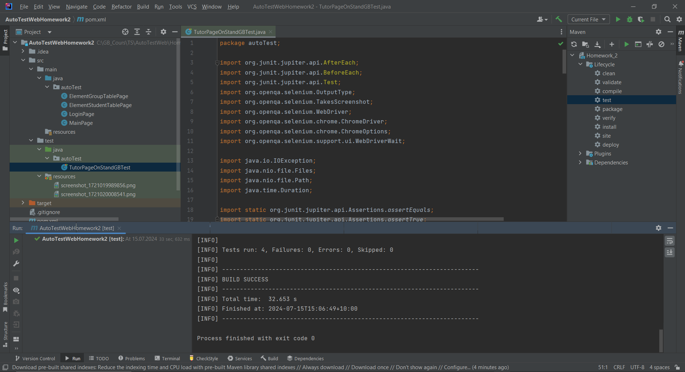

# Семинар: Паттерны проектирования в автоматизации UI
## Задание 1. 
Написать два теста - проверка ошибки на Login Page и на таблице студентов с реализацией 
нового кастомного элемента

Условие:
Написать два дополнительных теста
Логин в систему не вводя ни логин, ни пароль. На странице появляется ошибка, нужно проверить её текст
Более сложный тест на изменение количества студентов в созданной группе. В этом тесте потребуется 
реализовать строки другой таблицы используя паттерн Elements. 
Сценарий теста:
- Добавляем студентов в группу с помощью иконки ‘+’ в строке таблицы (клик + обработка модального окна)
- Проверить, что цифра отражающая количество студентов поменялась
- Клик на иконку увеличения - появляется таблица студентов в группе
- Проверяем количество студентов
- Кликаем на иконку корзины, например, для первого студента - проверяем как изменился его статус
- Кликаем на иконку восстановления для той же строки - проверяем что статус снова поменялся.

==========================================================================
## Test-Run проекта:

